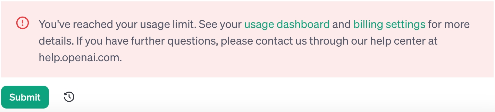

# langchain

## 虚拟环境配置/库安装: 

利用conda创建虚拟环境:<br>

```bash
conda create --name langchain python=3.10.11
```

激活虚拟环境:<br>

```bash
conda activate langchain
```

安装`langchain`:<br>

```bash
pip install langchain
# or
conda install langchain -c conda-forge
```


## openAI API use:

"Head to chat.openai.com."：这部分是一个建议或指令，意思是“前往 chat.openai.com。”。“Head to”是一个常用的英语短语，用来建议某人去某个地方。在这里，它意味着如果你想使用或了解更多关于ChatGPT的信息，应该访问网址“chat.openai.com”，这是一个特定的网站链接。<br>

Explore the API(探索这个应用程序编程接口 (API))<br>

[Watch the first OpenAI Developer Day keynote(观看首届 OpenAI 开发者日主题演讲)](https://youtu.be/U9mJuUkhUzk)

> OpenAI Developer Day:指的是由 OpenAI 组织的一个开发者日活动。
> keynote: 这个词在这里指的是某个会议或活动中的主要演讲或主题演讲。通常，这种演讲由重要人物进行，旨在阐述会议的主要主题或传达重要信息。

The OpenAI API can be applied to virtually any task. We offer a range of models with different capabilities and price points, as well as the ability to fine-tune custom models.

OpenAI API 实际上可以应用于任何任务。我们提供一系列具有不同功能和价格点的模型，以及微调定制模型的能力。


🚨🚨🚨Note:<br>

----

你可以在使用 openAI API 的过程中见到以下图片:



这是提醒你:

您已达到使用限额。欲了解更多详情，请查看您的使用仪表板和账单设置。如果您还有其他问题，请通过我们的帮助中心 help.openai.com 与我们联系。

----


请将下列内容翻译为地道的中文:
You've reached your usage limit. See your usage dashboard and billing settings for more details. If you have further questions, please contact us through our help center at help.openai.com.

请将下列内容翻译为地道的英文:

