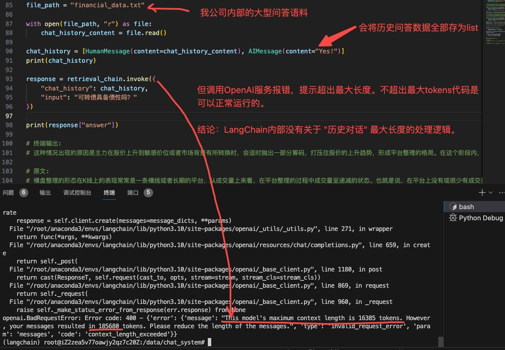
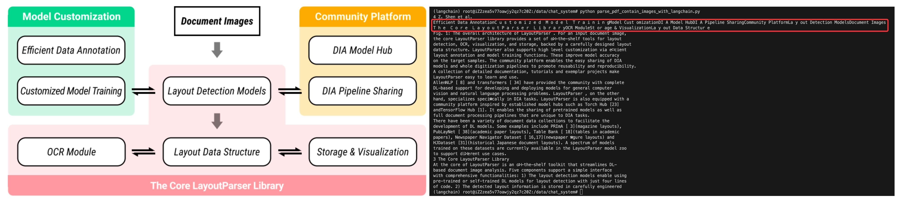

# LangChain

本项目基于LangChain官网翻译、添加自己的理解，主要用于个人研究、学习。<br>

- [LangChain](#langchain)
  - [Quickstart(快速入门):](#quickstart快速入门)
    - [Setup(安装):](#setup安装)
      - [Jupyter Notebook:](#jupyter-notebook)
      - [Installation:](#installation)
    - [LangSmith:](#langsmith)
    - [Building with LangChain(使用LangChain构建应用):](#building-with-langchain使用langchain构建应用)
    - [LLM Chain:](#llm-chain)
      - [OpenAI:](#openai)
      - [Local:](#local)
    - [拓展-python操作符| 的用法:](#拓展-python操作符-的用法)
    - [LangChain使用 | 操作符的原理:](#langchain使用--操作符的原理)
    - [Chain Debug:](#chain-debug)
    - [Retrieval Chain(检索链--查找并提取的过程):](#retrieval-chain检索链--查找并提取的过程)
      - [何时使用检索链:](#何时使用检索链)
      - [检索链完整代码:](#检索链完整代码)
      - [关于返回值的重要提醒:](#关于返回值的重要提醒)
      - [Diving Deeper(深入了解):](#diving-deeper深入了解)
    - [Conversation Retrieval Chain(对话检索链):](#conversation-retrieval-chain对话检索链)
      - [Updating Retrieval(更新检索):](#updating-retrieval更新检索)
      - [测试代码如下:](#测试代码如下)
      - [对话检索链完整代码:](#对话检索链完整代码)
      - [特别注意:](#特别注意)
    - [Agent(代理):](#agent代理)
    - [Agent 完整代码示例:](#agent-完整代码示例)
  - [Document loaders:](#document-loaders)
    - [PDF:](#pdf)
      - [Using PyPDF:](#using-pypdf)
    - [Extracting images(提取图像):](#extracting-images提取图像)
    - [Using MathPix:](#using-mathpix)
    - [Using Unstructured:](#using-unstructured)
      - [ModuleNotFoundError: No module named 'pdf2image':](#modulenotfounderror-no-module-named-pdf2image)
      - [ModuleNotFoundError: No module named 'pdfminer':](#modulenotfounderror-no-module-named-pdfminer)
      - [ModuleNotFoundError: No module named 'pillow\_heif':](#modulenotfounderror-no-module-named-pillow_heif)
      - [ModuleNotFoundError: No module named 'unstructured\_inference':](#modulenotfounderror-no-module-named-unstructured_inference)


## Quickstart(快速入门):

In this quickstart we'll show you how to:<br>

在这个快速入门中，我们将向你展示如何：<br>

- Get setup with LangChain, LangSmith and LangServe(开始安装和配置 LangChain、LangSmith 和 LangServe)

- Use the most basic and common components(组件) of LangChain: prompt templates, models, and output parsers(使用 LangChain 最基础和常见的组件：提示模板、模型和输出解析器)

- Use LangChain Expression Language(推测应该指的是langchain语言规则), the protocol(协议) that LangChain is built on and which facilitates(促进；使变得更简易) component chaining(链接；连接)(使用LangChain表达式语言，这是LangChain构建的协议，有助于组件链接)

- Build a simple application with LangChain(使用 LangChain 构建一个简单的应用程序)

- Trace your application with LangSmith(用 LangSmith 跟踪你的应用程序)

- Serve your application with LangServe(使用 LangServe 为你的应用程序提供服务（支撑），或者翻译为 "利用 LangServe 部署并运行你的应用程序。")

That's a fair amount to cover! Let's dive in.<br>

内容相当多！让我们开始吧。<br>

### Setup(安装):

#### Jupyter Notebook:

This guide (and most of the other guides in the documentation) use Jupyter notebooks and assume(假设) the reader is as well. Jupyter notebooks are perfect for learning how to work with LLM systems because often times things can go wrong (unexpected output, API down, etc) and going through guides in an interactive(交互的) environment is a great way to better understand them.<br>

本指南（以及文档中的大多数其他指南）都使用 Jupyter 笔记本，并假设读者也在使用。Jupyter 笔记本非常适合学习如何使用大型语言模型（LLM）系统，因为在操作过程中经常会出现问题（意外输出、API 故障等），而在交互式环境中浏览指南是更好地理解这些问题的绝佳方式。<br>

> "在交互式环境中浏览指南是更好地理解这些问题的绝佳方式" 应该指的是交互式环境能更好观察输出。毕竟IDE能DEBUG的优势太大hhh。

#### Installation:

利用conda创建虚拟环境:<br>

```bash
conda create --name langchain python=3.10.11
```

激活虚拟环境:<br>

```bash
conda activate langchain
```

安装`langchain`:<br>

```bash
pip install langchain
# or
conda install langchain -c conda-forge
```

> 笔者使用的是conda安装方式。

### LangSmith:

Many of the applications you build with LangChain will contain multiple steps with multiple invocations(调用) of LLM calls(这里应该指的是调用大模型的接口). As these applications get more and more complex, it becomes crucial(至关重要的) to be able to inspect(检查；仔细观察) what exactly is going on inside your chain(链) or agent(代理). The best way to do this is with LangSmith.<br>

使用LangChain构建应用程序包含多个步骤，涉及多次调用大语言模型（LLM）接口。随着这些应用程序变得越来越复杂，能够检查链条或代理中究竟发生了什么变得至关重要。做这事最佳的方法就是使用LangSmith。<br>

> multiple invocations(调用) of 表示多次调用。

Note that LangSmith is not needed, but it is helpful. If you do want to use LangSmith, after you sign up at the link above, make sure to set your environment variables to start logging traces:<br>

请注意，虽然LangSmith并非必需，但它非常有帮助。如果您想使用LangSmith，在通过上述链接注册后，确保设置您的环境变量以开始记录追踪日志：<br>

```bash
export LANGCHAIN_TRACING_V2="true"
export LANGCHAIN_API_KEY="..."
```

### Building with LangChain(使用LangChain构建应用):

LangChain enables building application that connect external(外部的) sources of data and computation(计算；计算过程) to LLMs. <br>

LangChain支持构建连接外部数据源和计算资源的大型语言模型（LLM）应用。<br>

In this quickstart, we will walk through(一步一步地展示或解释) a few different ways of doing that. We will start with a simple LLM chain, which just relies on(依赖) information in the prompt template to respond. <br>

在这个快速入门中，我们将介绍几种不同的实现方式。首先，我们将从一个简单的LLM链开始，它仅依赖于提示模板中的信息来进行回应。<br>

Next, we will build a retrieval(检索) chain, which fetches data from a separate(独立的) database and passes that into the prompt template. We will then add in chat history, to create a conversation retrieval chain(对话检索链). <br>

接下来，我们将构建一个检索链，它会从独立的数据库中获取数据，并将这些数据传递给提示模板。然后，我们将添加聊天历史记录，以创建一个对话检索链。<br>

This allows you interact(交互) in a chat manner with this LLM, **so it remembers previous questions**. <br>

这使您能够以聊天方式与这个LLM交互，**因此它能记住之前的问题**。<br>

Finally, we will build an agent - which utilizes(利用;使用;运用) an LLM to determine whether or not it needs to fetch data to answer questions. <br>

最后，我们将构建一个代理 - 它利用LLM来判断是否需要获取数据来回答问题。<br>

We will cover these at a high level, but there are lot of details to all of these! We will link to relevant docs.<br>

> 推测大概是指站在高处更容易看清事物本质。

我们将从高层次上介绍这些内容，但这些都有很多细节！我们将链接到相关文档。<br>

### LLM Chain:

For this getting started guide, we will provide two options: using OpenAI (a popular model available via API) or using a local open source model.<br>

对于这个入门指南，我们将提供两种选择：使用 OpenAI（一种可以通过 API 调用的流行模型）或使用本地开源模型。<br>

#### OpenAI:

First we'll need to import the LangChain x OpenAI integration(集成) package.<br>

首先，我们需要导入 LangChain 与 OpenAI 的集成包。<br>

```bash
pip install langchain-openai
```

Accessing the API requires an API key, which you can get by creating an account(账户) and heading(前往) [here](https://platform.openai.com/api-keys). Once we have a key we'll want to set it as an environment variable by running:<br>

要访问 API，你需要一个 API 密钥，可以通过创建一个账户并前往这里来获取。一旦我们拥有了密钥，我们会想要通过运行以下命令将其设置为一个环境变量：<br>

```bash
export OPENAI_API_KEY="your-api-key-here"
```

We can then initialize the model:<br>

然后我们可以初始化模型：<br>

```python
from langchain_openai import ChatOpenAI

llm = ChatOpenAI()
```

If you'd prefer not to set an environment variable you can pass the key in directly(直接地) via the `openai_api_key` named parameter when initiating the OpenAI LLM class:<br>

如果你不想设置环境变量，你可以在初始化 OpenAI LLM 类时，直接通过 openai_api_key 这个命名参数传入密钥：<br>

```python
from langchain_openai import ChatOpenAI

llm = ChatOpenAI(openai_api_key="...")
```

Once you've installed and initialized the LLM of your choice, we can try using it!<br>

一旦你安装并初始化了你选择的 LLM，我们就可以尝试使用它了！<br>

Let's ask it what LangSmith is - this is something that wasn't present in the training data so it shouldn't have a very good response.<br>

让我们问问它 LangSmith 是什么 - 这是训练数据中没有的内容，所以它应该不会有很好的回答。<br>

```python
llm.invoke("how can langsmith help with testing?")
```

> 在编程领域，"invoke a function" 表示 "调用一个函数"，所以上述代码中 "invoke" 的意思大概率是 "调用"。

笔者在IDE中测试的效果如下:<br>

> 必须保证终端能够连接openai服务，才可以使用以下代码。
> 经测试，运行`llm.invoke("...")`后终端以非流式输出形式返回。

```python
import os
from dotenv import load_dotenv
from langchain_openai import ChatOpenAI

# 加载环境变量
dotenv_path = '.env.local'
load_dotenv(dotenv_path=dotenv_path)

llm = ChatOpenAI(openai_api_key=os.getenv("OPENAI_API_KEY"))

llm_response = llm.invoke("你好")

print(llm_response)     # content='你好！有什么我可以帮助你的吗？'
print(type(llm_response))   # <class 'langchain_core.messages.ai.AIMessage'>
print(llm_response.content) # 你好！有什么我可以帮助你的吗？
```

We can also guide(指导；引导) it's response with a prompt template(模板). Prompt templates are used to convert(转换) raw user input to a better input to the LLM.<br>

我们还可以使用提示模板来引导其回应。提示模板用于将原始用户输入转换为更适合语言模型（LLM）的输入。

```python
from langchain_core.prompts import ChatPromptTemplate
prompt = ChatPromptTemplate.from_messages([
    ("system", "You are world class technical documentation writer."),  # 英文的意思是: 你是世界级的技术文档撰写专家(写手)。
    ("user", "{input}")
])
```

We can now combine these into a simple LLM chain:<br>

现在，我们可以将这些组合成一个简单的LLM链：<br>

```python
chain = prompt | llm 
```

We can now invoke(调用) it and ask the same question. It still won't know the answer, but it should respond(回应) in a more proper tone for a technical writer!<br>

现在我们可以调用它并询问相同的问题。它仍然不会知道答案，但应该以更适合技术写手的语气回应！<br>

```python
chain.invoke({"input": "how can langsmith help with testing?"})
```

笔者所用的完整代码如下:<br>

```python
import os
from dotenv import load_dotenv
from langchain_openai import ChatOpenAI
from langchain_core.prompts import ChatPromptTemplate

# 加载环境变量
dotenv_path = '.env.local'
load_dotenv(dotenv_path=dotenv_path)

llm = ChatOpenAI(openai_api_key=os.getenv("OPENAI_API_KEY"))

prompt = ChatPromptTemplate.from_messages([
    ("system", "You are world class technical documentation writer."),
    ("user", "{input}")
])

chain = prompt | llm 

chain_response = chain.invoke({"input": "how can langsmith help with testing?"})

print(chain_response.content)
```

The output of a ChatModel (and therefore, of this chain) is a message. However, it's often much more convenient to work with strings. Let's add a simple output parser to convert the chat message to a string.<br>

> "and therefore, of this chain" 这个短语的意思是 "因此，对于这个链也是如此"。搞不懂 "因此，对于这个链也是如此" 在这句话中的含义，但不妨碍整句话的理解。

ChatModel（因此，对于这个链也是如此）的输出是一条消息。然而，使用字符串通常更方便。让我们添加一个简单的输出解析器，将聊天消息转换为字符串。<br>

```python
from langchain_core.output_parsers import StrOutputParser

output_parser = StrOutputParser()
```

We can now add this to the previous(之前的) chain:<br>

现在我们可以将这个添加到之前的链中：<br>

```python
chain = prompt | llm | output_parser
```

We can now invoke(调用) it and ask the same question. The answer will now be a string (rather than a ChatMessage).<br>

现在我们可以调用它并提出同样的问题。现在的答案将是一个字符串（而不是ChatMessage）。<br>

```python
chain.invoke({"input": "how can langsmith help with testing?"})
```

笔者所用完整代码:<br>

```python
import os
from dotenv import load_dotenv
from langchain_openai import ChatOpenAI
from langchain_core.prompts import ChatPromptTemplate
from langchain_core.output_parsers import StrOutputParser

# 加载环境变量
dotenv_path = '.env.local'
load_dotenv(dotenv_path=dotenv_path)

llm = ChatOpenAI(openai_api_key=os.getenv("OPENAI_API_KEY"))

prompt = ChatPromptTemplate.from_messages([
    ("system", "You are world class technical documentation writer."),
    ("user", "{input}")
])

output_parser = StrOutputParser()

chain = prompt | llm | output_parser

chain_response = chain.invoke({"input": "how can langsmith help with testing?"})

print(chain_response)
print(type(chain_response))     # <class 'str'>
```

这次添加了结果解析器，输出的直接是 `string` 类型的结果，其实和之前笔者使用的 `print(chain_response.content)` 效果相同。<br>

#### Local:

Ollama allows you to run open-source large language models, such as Llama 2, locally.<br>

Ollama 使你能够在本地运行开源的大型语言模型，比如 Llama 2。<br>

First, follow these instructions(指示) to set up and run a local Ollama instance(实例):<br>

首先，按照以下指示来设置并运行一个本地的 Ollama 实例：<br>

- Download
- Fetch a model via `ollama pull llama2`(通过 `ollama pull llama2` 命令获取模型)

Then, make sure the Ollama server is running. After that, you can do:<br>

然后，确保 Ollama 服务器正在运行。之后，你可以进行：<br>


### 拓展-python操作符| 的用法:

Python 中的 `|` 操作符主要有两种用途，具体用法取决于它被用在什么上下文中：<br>

1. **按位或（Bitwise OR）**：当 `|` 用于整数时，它执行按位或操作。这意味着对两个数的二进制表示进行操作，只要对应位中至少有一个为1，则结果的该位也为1。

例如：<br>

```python
a = 0b1010  # 二进制表示，等于十进制中的10
b = 0b0101  # 二进制表示，等于十进制中的5
result = a | b  # 结果将是0b1111，即十进制中的15
```

2. **集合的并集（Set Union）**：当 `|` 用在两个集合上时，它返回一个包含所有在两个集合中的元素的新集合，相当于两个集合的并集。

例如：<br>

```python
set1 = {1, 2, 3}
set2 = {3, 4, 5}
result = set1 | set2  # 结果将是{1, 2, 3, 4, 5}
```

从 Python 3.9 开始，`|` 还可以用于字典，表示合并两个字典：<br>

3. **字典的合并（Dictionary Merge）**：使用 `|` 操作符可以合并两个字典，如果两个字典有相同的键，则第二个字典中的键值对会覆盖第一个字典中的键值对。

例如：<br>

```python
dict1 = {'a': 1, 'b': 2}
dict2 = {'b': 3, 'c': 4}
result = dict1 | dict2  # 结果将是{'a': 1, 'b': 3, 'c': 4}
```

这些是 `|` 操作符在 Python 中的主要用途。它的确切行为取决于操作数的类型。<br>

### LangChain使用 | 操作符的原理:

`LangChain` 使用 `|` 操作符的能力不是 Python 语言内建的功能，而是通过自定义类和重载运算符实现的。Python 允许类通过定义特殊方法（也称为魔术方法或双下划线方法）来重载（override）或实现特定的运算符行为。对于 `|` 操作符，相关的魔术方法是 `__or__`。<br>

> 经Debug验证，LangChain使用的确实是 `__or__`方法。

当你 `LangChain` 使用 `|` 操作符以非标准方式（例如，不是按位或、集合并集或字典合并），这通常意味着该类定义了一个 `__or__` 方法来自定义 `|` 操作符的行为。<br>

这种技术允许开发者创建更具表达性和领域特定的语法，提高代码的可读性和易用性。例如，一个数据处理库可能允许你将数据转换或过滤操作以链式方式连接起来，使用 `|` 操作符来表示这种连接，使得代码更加直观。<br>

这里是一个简化的例子，演示如何为一个类重载 `|` 操作符：<br>

```python
class CustomClass:
    def __init__(self, value):
        self.value = value

    # 定义 | 操作符的行为
    def __or__(self, other):
        # 这里可以定义任何自定义逻辑
        # 例如，我们可以简单地合并两个对象的值
        return CustomClass(self.value + other.value)

# 使用自定义的 | 操作符
a = CustomClass(5)
b = CustomClass(10)
result = a | b
print(result.value)  # 输出：15
```

在这个例子中，`CustomClass` 的实例 `a` 和 `b` 能够使用 `|` 操作符，其行为是将两个实例的 `value` 属性值相加，因为我们在 `CustomClass` 中定义了 `__or__` 方法来实现这一行为。<br>

本质上执行的是 `a | b` 执行的是 `a.__or__(b)` ，把 `b` 作为了 `other` 。<br>

具体逻辑图如下:<br>


当运行到 `chain = prompt | llm | output_parser` 时，Debug发现，其实是跳转到了LangChain中 `Runnable` 类的 `__or__` 方法。<br>

```python
class Runnable(Generic[Input, Output], ABC):
  
  # 省略其他函数

  def __or__(
      self,
      other: Union[
          Runnable[Any, Other],
          Callable[[Any], Other],
          Callable[[Iterator[Any]], Iterator[Other]],
          Mapping[str, Union[Runnable[Any, Other], Callable[[Any], Other], Any]],
      ],
  ) -> RunnableSerializable[Input, Other]:
      """Compose this runnable with another object to create a RunnableSequence.
      译: 将此 runnable 与另一个对象组合，以创建一个 RunnableSequence。
      """
      return RunnableSequence(self, coerce_to_runnable(other))
```

```python
def coerce_to_runnable(thing: RunnableLike) -> Runnable[Input, Output]:
    """Coerce(强制;强迫) a runnable-like object into a Runnable.

    Args:
        thing: A runnable-like object.

    Returns:
        A Runnable.
    """
    if isinstance(thing, Runnable):
        return thing
    elif inspect.isasyncgenfunction(thing) or inspect.isgeneratorfunction(thing):
        return RunnableGenerator(thing)
    elif callable(thing):
        return RunnableLambda(cast(Callable[[Input], Output], thing))
    elif isinstance(thing, dict):
        return cast(Runnable[Input, Output], RunnableParallel(thing))
    else:
        raise TypeError(
            f"Expected a Runnable, callable or dict."
            f"Instead got an unsupported type: {type(thing)}"
        )
```


```python
class RunnableSequence(RunnableSerializable[Input, Output]):
    """A sequence of runnables, where the output of each is the input of the next.

    RunnableSequence is the most important composition operator in LangChain as it is
    used in virtually every chain.

    A RunnableSequence can be instantiated directly or more commonly by using the `|`
    operator where either the left or right operands (or both) must be a Runnable.

    Any RunnableSequence automatically supports sync, async, batch.

    The default implementations of `batch` and `abatch` utilize threadpools and
    asyncio gather and will be faster than naive invocation of invoke or ainvoke
    for IO bound runnables.

    Batching is implemented by invoking the batch method on each component of the
    RunnableSequence in order.

    A RunnableSequence preserves the streaming properties of its components, so if all
    components of the sequence implement a `transform` method -- which
    is the method that implements the logic to map a streaming input to a streaming
    output -- then the sequence will be able to stream input to output!

    If any component of the sequence does not implement transform then the
    streaming will only begin after this component is run. If there are
    multiple blocking components, streaming begins after the last one.

    Please note: RunnableLambdas do not support `transform` by default! So if
        you need to use a RunnableLambdas be careful about where you place them in a
        RunnableSequence (if you need to use the .stream()/.astream() methods).

        If you need arbitrary logic and need streaming, you can subclass
        Runnable, and implement `transform` for whatever logic you need.

    Here is a simple example that uses simple functions to illustrate the use of
    RunnableSequence:

        .. code-block:: python

            from langchain_core.runnables import RunnableLambda

            def add_one(x: int) -> int:
                return x + 1

            def mul_two(x: int) -> int:
                return x * 2

            runnable_1 = RunnableLambda(add_one)
            runnable_2 = RunnableLambda(mul_two)
            sequence = runnable_1 | runnable_2
            # Or equivalently:
            # sequence = RunnableSequence(first=runnable_1, last=runnable_2)
            sequence.invoke(1)
            await sequence.ainvoke(1)

            sequence.batch([1, 2, 3])
            await sequence.abatch([1, 2, 3])

    Here's an example that uses streams JSON output generated by an LLM:

        .. code-block:: python

            from langchain_core.output_parsers.json import SimpleJsonOutputParser
            from langchain_openai import ChatOpenAI

            prompt = PromptTemplate.from_template(
                'In JSON format, give me a list of {topic} and their '
                'corresponding names in French, Spanish and in a '
                'Cat Language.'
            )

            model = ChatOpenAI()
            chain = prompt | model | SimpleJsonOutputParser()

            async for chunk in chain.astream({'topic': 'colors'}):
                print('-')
                print(chunk, sep='', flush=True)
    """

    # The steps are broken into first, middle and last, solely for type checking
    # purposes. It allows specifying the `Input` on the first type, the `Output` of
    # the last type.
    first: Runnable[Input, Any]
    """The first runnable in the sequence."""
    middle: List[Runnable[Any, Any]] = Field(default_factory=list)
    """The middle runnables in the sequence."""
    last: Runnable[Any, Output]
    """The last runnable in the sequence."""

    def __init__(
        self,
        *steps: RunnableLike,
        name: Optional[str] = None,
        first: Optional[Runnable[Any, Any]] = None,
        middle: Optional[List[Runnable[Any, Any]]] = None,
        last: Optional[Runnable[Any, Any]] = None,
    ) -> None:
        """Create a new RunnableSequence.

        Args:
            steps: The steps to include in the sequence.
        """
        steps_flat: List[Runnable] = []
        if not steps:
            if first is not None and last is not None:
                steps_flat = [first] + (middle or []) + [last]
        for step in steps:
            if isinstance(step, RunnableSequence):
                steps_flat.extend(step.steps)
            else:
                steps_flat.append(coerce_to_runnable(step))
        if len(steps_flat) < 2:
            raise ValueError(
                f"RunnableSequence must have at least 2 steps, got {len(steps_flat)}"
            )
        super().__init__(
            first=steps_flat[0],
            middle=list(steps_flat[1:-1]),
            last=steps_flat[-1],
            name=name,
        )
```

### Chain Debug:


### Retrieval Chain(检索链--查找并提取的过程):

In order to properly(恰当的) answer the original(原始的) question ("how can langsmith help with testing?"), we need to provide additional(额外的) context to the LLM.<br>

为了恰当回答原始问题（"langsmith 如何帮助进行测试？"），我们需要向 LLM 提供额外的上下文。<br>

 We can do this via retrieval. Retrieval is useful when you have too much data to pass to the LLM directly(直接地)(too..to... 太...而不能...). You can then use a retriever to fetch only the most relevant pieces(最相关的片段) and pass those in.<br>

这可以通过检索来实现。当你有太多数据不能直接传递给 LLM 时，检索非常有用。你可以使用检索器只获取最相关的数据片段然后传入。<br>


In this process, we will look up(查询) relevant documents from a Retriever and then pass them into the prompt. A Retriever can be backed(可以依据...) by anything - a SQL table, the internet, etc - but in this instance(实例) we will populate(生活于；填充) a vector store and use that as a retriever. For more information on vectorstores, see this [documentation](https://python.langchain.com/docs/modules/data_connection/vectorstores).<br>

在这个过程中，我们将从检索器中查找相关文档，然后将它们传入提示中。检索器可以由任何东西支持——一个 SQL 表，互联网等——但在这个例子中，我们将填充一个向量存储并使用它作为检索器。有关向量存储的更多信息，请参阅此文档。<br>

First, we need to load(加载) the data that we want to index(检索). In order to do this, we will use the `WebBaseLoader`. This requires installing `BeautifulSoup`:<br>

首先，我们需要加载我们想要索引的数据。为了做到这一点，我们将使用 `WebBaseLoader` 。这需要安装 `BeautifulSoup`：<br>

```bash
pip install beautifulsoup4
```

After that, we can import and use WebBaseLoader.<br>

之后，我们可以导入并使用 WebBaseLoader。<br>

```python
from langchain_community.document_loaders import WebBaseLoader
loader = WebBaseLoader("https://docs.smith.langchain.com/overview")

docs = loader.load()
```

代码解释:<br>

上述代码使用了`langchain_community.document_loaders`模块中的`WebBaseLoader`类，目的是从指定的URL加载文档。具体来说，它创建了一个指向URL "https://docs.smith.langchain.com/overview" 的`WebBaseLoader`实例。然后，调用此实例上的`load`方法来从指定的URL获取和加载内容。<br>

以下是`WebBaseLoader`工作方式及其功能的详细解释，这些信息根据LangChain文档提供：<br>

- **初始化**：`WebBaseLoader`在初始化时可以设置多个参数，如`web_path`（要从中加载的URLs）、`header_template`（请求的HTTP头）和`verify_ssl`（是否验证SSL证书）等。此类旨在使用`urllib`加载HTML页面，并用`BeautifulSoup`解析，`BeautifulSoup`是一个用于从HTML和XML文件中提取数据的库【7†来源】。

- **加载方法**：`load`方法特别用于从初始化时指定的URL(s)获取和解析HTML内容。它使用`BeautifulSoup`进行解析，如果提供了多个URLs，也可以处理。加载器支持异步操作，请求的速率限制，以及通过BeautifulSoup进行自定义解析选项。

- **功能**：该类除了`load`方法外，还提供了如`aload`（异步加载）、`fetch_all`（并发带速率限制地获取多个URLs）、`lazy_load`（按需加载内容）以及`scrape`或`scrape_all`（用BeautifulSoup获取和解析内容）等多种方法。这些方法允许在灵活的网页抓取和内容处理场景中使用。

这个加载器是LangChain文档加载基础设施的一部分，旨在促进网页内容的检索和处理，以供下游应用使用，如自然语言处理任务、数据分析或输入到机器学习模型中。<br>

Next, we need to index it into a vectorstore. This requires a few components, namely an [embedding model](https://python.langchain.com/docs/modules/data_connection/text_embedding) and [a vectorstore](https://python.langchain.com/docs/modules/data_connection/vectorstores).<br>

接下来，我们需要将其索引到一个向量存储中。这需要几个组件，即一个嵌入模型和一个向量存储。<br>

For embedding models, we once again provide examples for accessing via OpenAI or via local models.<br>

对于嵌入模型，我们再次提供了通过 OpenAI 或通过本地模型访问的例子。<br>

Make sure you have the `langchain_openai` package installed an the appropriate environment variables set (these are the same as needed for the LLM).<br>

请确保你已安装 `langchain_openai` 包，并设置了适当的环境变量（这些与使用大型语言模型（LLM）所需的环境变量相同）。<br>

```python
from langchain_openai import OpenAIEmbeddings

embeddings = OpenAIEmbeddings()
```

Now, we can use this embedding model to ingest(摄入；导入) documents into a vectorstore. We will use a simple local vectorstore, [FAISS](https://python.langchain.com/docs/integrations/vectorstores/faiss), for simplicity's sake.<br>

> sake 通常用于表达做某事的原因或目的。例如，"for simplicity's sake" 意味着为了简单起见；"for the sake of clarity" 意味着为了清晰起见。

现在，我们可以使用这个嵌入模型将文档摄入到一个向量存储中。为了简单起见，我们将使用一个简单的本地向量存储，FAISS。<br>

First we need to install the required packages for that:<br>

首先，我们需要安装所需的包：<br>

```bash
pip install faiss-cpu
```

> faiss向量库经过 `pip install faiss-cpu` 后就可以用，不需要额外安装。

Then we can build our index:<br>

然后我们可以构建我们的索引：<br>

```python
from langchain_community.vectorstores import FAISS
from langchain.text_splitter import RecursiveCharacterTextSplitter

# "RecursiveCharacterTextSplitter"可以拆解为几个部分来理解：

# Recursive（递归的）、Character（字符）、Text（文本）、Splitter（分割器）

# "RecursiveCharacterTextSplitter"大致意味递归地将文本按字符分割。从一个较大的文本块开始，并递归地将其分解为单个字符，每次迭代处理更小的文本片段，直到整个文本被细分为单独的字符。

text_splitter = RecursiveCharacterTextSplitter()
documents = text_splitter.split_documents(docs)
vector = FAISS.from_documents(documents, embeddings)
```

点击 `langchain_community.vectorstores` 后内容详解:<br>

**Vector store** stores embedded data and performs vector search.（**向量存储**用于存储嵌入数据并执行向量搜索。）<br>

One of the most common(常见的) ways to store and search over unstructured(非结构化) data is to embed it and store the resulting embedding vectors, and then query the store and retrieve(检索) the data that are 'most similar'(最相似) to the embedded query.<br>

存储和搜索非结构化数据的最常见方法之一是将其向量化，存储转化后的词向量，然后查询并检索与嵌入查询“最相似”的数据。<br>

**Class hierarchy(类层次结构):**

.. code-block(代码块)::<br>

```python
VectorStore --> <name>  # Examples: Annoy, FAISS, Milvus

BaseRetriever --> VectorStoreRetriever --> <name>Retriever  # Example: VespaRetriever
```

**Main helpers(主要助手):**<br>

.. code-block(代码块)::<br>

```python
Embeddings, Document
```

Now that we have this data indexed(索引到) in a vectorstore, we will create a retrieval chain. <br>

既然我们已经将这些数据索引到向量存储中，我们将创建一个检索链。<br>

This chain will take an incoming question, look up relevant documents, then pass those documents along with the original question into an LLM and ask it to answer the original question.<br>

该链将接收一个输入的问题，查找相关文档，然后将这些文档连同原始问题传递给一个LLM，并要求其回答原始问题。<br>

First, let's set up the chain that takes a question and the retrieved documents and generates an answer.<br>

首先，让我们设置一个链，该链接收一个问题和检索到的文档，并生成一个答案。<br>

```python
from langchain.chains.combine_documents import create_stuff_documents_chain

prompt = ChatPromptTemplate.from_template("""Answer the following question based only on the provided context:

<context>
{context}
</context>

Question: {input}""")

document_chain = create_stuff_documents_chain(llm, prompt)
```

If we wanted to, we could run this ourselves by passing in documents directly:<br>

如果我们愿意的话，我们可以直接通过传入文档来自行运行这个过程。<br>

```python
from langchain_core.documents import Document

document_chain.invoke({
    "input": "how can langsmith help with testing?",
    "context": [Document(page_content="langsmith can let you visualize test results")]
})
```

However, we want the documents to first come from the retriever we just set up. That way, for a given question we can use the retriever to dynamically(动态的) select the most relevant documents and pass those in.<br>

然而，我们希望文档首先来自我们刚刚设置的检索器。这样，对于给定的问题，我们可以使用检索器动态地选择最相关的文档并传递给模型。<br>

```python
from langchain.chains import create_retrieval_chain

retriever = vector.as_retriever()
retrieval_chain = create_retrieval_chain(retriever, document_chain)
```

We can now invoke this chain. This returns a dictionary - the response from the LLM is in the answer key.<br>

我们现在可以调用这个链条了。这将返回一个字典 - LLM的响应位于 `answer` 键中。<br>

```python
response = retrieval_chain.invoke({"input": "how can langsmith help with testing?"})
print(response["answer"])

# LangSmith offers several features that can help with testing:...
```

This answer should be much more accurate!<br>

这个答案应该更准确！<br>

#### 何时使用检索链:

LangChain 支持检索链的功能是为了在处理问题时提供更加丰富和准确的信息来源。检索链允许系统通过检索外部数据源来增强其回答的质量和准确性。你决定何时使用检索链而不是直接回复，可以基于以下几个考虑因素：<br>

1. **问题的复杂性和特定性**：如果问题非常复杂或需要特定领域的深入知识，使用检索链可能会更好，因为它可以访问最新的或最相关的信息。

2. **信息的时效性**：对于需要最新信息的问题（如新闻事件、最近的科学发现等），使用检索链可以帮助获取最新数据。

3. **可用数据的限制**：如果问题涉及到的信息可能不包含在模型训练数据中，或者信息已经过时，那么使用检索链可以访问最新和最相关的外部资源。

4. **精确度和可靠性的要求**：对于需要高度准确和可靠答案的情况（比如医疗、法律咨询等），检索链可以通过访问权威数据源来提供支持。

5. **用户的偏好**：有时候，用户可能更倾向于获取经过验证的信息源提供的答案，而不是直接从模型生成的回答。

6. **用户是否上传超大型文件**: 如果用户上传超大型文件，可以采用先对该文件切分、向量化并存储到向量库操作，后续调用检索链检索。

在决定是否使用检索链时，还要考虑检索过程可能增加的时间延迟和资源消耗。直接回复通常更快，但可能不如检索链回复的信息全面或准确。<br>

🚀🚀🚀 **最好的情况是，普通状态下让大模型直接回复，用户上传超大型文件(可以通过计算token判断)后采用检索链。** <br>

总的来说，当面对需要高度专业知识、最新信息、或者对答案准确性和可靠性有高要求的问题时，使用检索链会是一个好选择。对于一般性的问题，直接回复可能更为高效和合适。<br>

#### 检索链完整代码:

```python
"""
@author:PeilongChen(peilongchencc@163.com)
@description:实现基于LangChain的文档检索链。
"""
import os
from dotenv import load_dotenv
from langchain_community.document_loaders import TextLoader
from langchain_openai import OpenAIEmbeddings
from langchain_community.vectorstores import FAISS
from load_file_split_documents import ChineseRecursiveTextSplitter
from langchain_core.prompts import ChatPromptTemplate
from langchain.chains.combine_documents import create_stuff_documents_chain
from langchain_openai import ChatOpenAI
from langchain.chains import create_retrieval_chain

# 加载环境变量
dotenv_path = '.env.local'
load_dotenv(dotenv_path=dotenv_path)

# 设置网络代理环境变量
os.environ['http_proxy'] = 'http://127.0.0.1:7890'
os.environ['https_proxy'] = 'http://127.0.0.1:7890'


########################################################################
# 文档切分，进行向量化，并存入FAISS
########################################################################

chunk_overlap = 50
chunk_size = 500
# 替换为你的文件路径
filepath = 'example_data.txt'
# 使用LangChain内置txt文件加载器
loader = TextLoader(filepath)
# 使用加载器加载文档
docs = loader.load()    # 数据类型为list [(page_content='（一）直接打压式\n洗盘\n直接打压较多出现在 庄家 吸货区域，目的是... metadata={'source': 'example_data.txt'}' metadata={'source': 'example_data.txt'})]
# 调用OpenAI的Embeddings API
embeddings = OpenAIEmbeddings(openai_api_key=os.getenv("OPENAI_API_KEY"))
# 实例化自定义的文本分割器
text_splitter = ChineseRecursiveTextSplitter(chunk_size=chunk_size, chunk_overlap=chunk_overlap)
# 进行文本分割
documents = text_splitter.split_documents(docs)
vector = FAISS.from_documents(documents, embeddings)

########################################################################
# 调用大模型(接口)，构建prompt
########################################################################

llm = ChatOpenAI(
    openai_api_key=os.getenv("OPENAI_API_KEY"),
    # model_name="gpt-4-0125-preview"
    )
# 让模型 "仅根据提供的上下文回答以下问题"
prompt = ChatPromptTemplate.from_template("""Answer the following question based only on the provided context:

<context>
{context}
</context>

Question: {input}""")

document_chain = create_stuff_documents_chain(llm, prompt)  # "input" 和 "context" 参数会从 `.invoke()` 的参数中获取。

########################################################################
# 构建检索链
########################################################################

retriever = vector.as_retriever()
retrieval_chain = create_retrieval_chain(retriever, document_chain)

response = retrieval_chain.invoke({"input": "横盘整理的形态是什么样子?"})

# print(response)

print(response["answer"])

# 由于结果含有随机性，笔者终端见到的2种回复如下:
# 回复1: 横盘整理的形态在K线上的表现常常是一条横线或者长期的平台。
# 回复2: 横盘整理的形态在K线上的表现常常是一条横线或者长期的平台，从成交量上来看，在平台整理的过程中成交量呈递减的状态。也就是说，在平台上没有或很少有成交量放出。成交清淡，成交价格也极度不活跃。
```

`invoke()`函数的内部解释如下:<br>

```txt
"""Transform a single input into an output. Override to implement.

Args:
    input: The input to the runnable.
    config: A config to use when invoking the runnable.
        The config supports standard keys like 'tags', 'metadata' for tracing
        purposes, 'max_concurrency' for controlling how much work to do
        in parallel, and other keys. Please refer to the RunnableConfig
        for more details.

Returns:
    The output of the runnable.
"""
```

意思是:<br>

```txt
将单一输入转换为输出。重写以实现。

参数：
- input：运行对象的输入。
- config：调用运行对象时使用的配置。该配置支持如'tags'、'metadata'等标准键用于追踪目的，'max_concurrency'用于控制并行工作的量，以及其他键。请参阅RunnableConfig以获取更多详情。

返回值：
- 运行对象的输出。
```

`as_retriever`的用法如下:<br>

```python
def as_retriever(self, **kwargs: Any) -> VectorStoreRetriever:
    """Return VectorStoreRetriever initialized from this VectorStore.
    Args:
        search_type (Optional[str]): Defines the type of search that
            the Retriever should perform.
            Can be "similarity" (default), "mmr", or
            "similarity_score_threshold".
        search_kwargs (Optional[Dict]): Keyword arguments to pass to the
            search function. Can include things like:
                k: Amount of documents to return (Default: 4)
                score_threshold: Minimum relevance threshold
                    for similarity_score_threshold
                fetch_k: Amount of documents to pass to MMR algorithm (Default: 20)
                lambda_mult: Diversity of results returned by MMR;
                    1 for minimum diversity and 0 for maximum. (Default: 0.5)
                filter: Filter by document metadata

    Returns:
        VectorStoreRetriever: Retriever class for VectorStore.

    Examples:

    .. code-block:: python

        # Retrieve more documents with higher diversity
        # Useful if your dataset has many similar documents
        docsearch.as_retriever(
            search_type="mmr",
            search_kwargs={'k': 6, 'lambda_mult': 0.25}
        )

        # Fetch more documents for the MMR algorithm to consider
        # But only return the top 5
        docsearch.as_retriever(
            search_type="mmr",
            search_kwargs={'k': 5, 'fetch_k': 50}
        )

        # Only retrieve documents that have a relevance score
        # Above a certain threshold
        docsearch.as_retriever(
            search_type="similarity_score_threshold",
            search_kwargs={'score_threshold': 0.8}
        )

        # Only get the single most similar document from the dataset
        docsearch.as_retriever(search_kwargs={'k': 1})

        # Use a filter to only retrieve documents from a specific paper
        docsearch.as_retriever(
            search_kwargs={'filter': {'paper_title':'GPT-4 Technical Report'}}
        )
    """
    tags = kwargs.pop("tags", None) or []
    tags.extend(self._get_retriever_tags())
    return VectorStoreRetriever(vectorstore=self, **kwargs, tags=tags)
```

#### 关于返回值的重要提醒:

调用上述检索链代码时，是无法返回分数的(LangChain默认使用的L2欧氏距离)。如果你想返回分数，需要自己修改LangChain中的内容，相关代码如下:<br>

```python
class FAISS(VectorStore):
    """`Meta Faiss` vector store.

    To use, you must have the ``faiss`` python package installed.

    Example:
        .. code-block:: python

            from langchain_community.embeddings.openai import OpenAIEmbeddings
            from langchain_community.vectorstores import FAISS

            embeddings = OpenAIEmbeddings()
            texts = ["FAISS is an important library", "LangChain supports FAISS"]
            faiss = FAISS.from_texts(texts, embeddings)

    """

    def __init__(
        self,
        embedding_function: Union[
            Callable[[str], List[float]],
            Embeddings,
        ],
        index: Any,
        docstore: Docstore,
        index_to_docstore_id: Dict[int, str],
        relevance_score_fn: Optional[Callable[[float], float]] = None,
        normalize_L2: bool = False,
        distance_strategy: DistanceStrategy = DistanceStrategy.EUCLIDEAN_DISTANCE,
    ):
        """Initialize with necessary components."""
        if not isinstance(embedding_function, Embeddings):
            logger.warning(
                "`embedding_function` is expected to be an Embeddings object, support "
                "for passing in a function will soon be removed."
            )
        self.embedding_function = embedding_function
        self.index = index
        self.docstore = docstore
        self.index_to_docstore_id = index_to_docstore_id
        self.distance_strategy = distance_strategy
        self.override_relevance_score_fn = relevance_score_fn
        self._normalize_L2 = normalize_L2
        if (
            self.distance_strategy != DistanceStrategy.EUCLIDEAN_DISTANCE
            and self._normalize_L2
        ):
            warnings.warn(
                "Normalizing L2 is not applicable for metric type: {strategy}".format(
                    strategy=self.distance_strategy
                )
            )

    # 其他代码省略

    def similarity_search(
        self,
        query: str,
        k: int = 4,
        filter: Optional[Union[Callable, Dict[str, Any]]] = None,
        fetch_k: int = 20,
        **kwargs: Any,
    ) -> List[Document]:
        """Return docs most similar to query.

        Args:
            query: Text to look up documents similar to.
            k: Number of Documents to return. Defaults to 4.
            filter: (Optional[Dict[str, str]]): Filter by metadata. Defaults to None.
            fetch_k: (Optional[int]) Number of Documents to fetch before filtering.
                      Defaults to 20.

        Returns:
            List of Documents most similar to the query.
        """
        docs_and_scores = self.similarity_search_with_score(
            query, k, filter=filter, fetch_k=fetch_k, **kwargs
        )
        return [doc for doc, _ in docs_and_scores]
```

具体的文件路径类似如下:<br>

```bash
/root/anaconda3/envs/langchain/lib/python3.10/site-packages/langchain_community/vectorstores/faiss.py
```

由上述代码可以看出，`FAISS` 类中函数 `similarity_search` 的返回值只返回了文档doc。如果你想修改返回值，可以从这里下手。<br>

也可采用下列方式继承 `FAISS` 类，重写函数 `similarity_search`:<br>

```python
class ExtendedFAISS(FAISS):
    def similarity_search(
        self,
        query: str,
        k: int = 4,
        filter: Optional[Union[Callable, Dict[str, Any]]] = None,
        fetch_k: int = 20,
        **kwargs: Any,
    ) -> List[Tuple[Document, float]]:
        """
        重写similarity_search方法以返回文档及其分数。

        参数:
            query: 要查找相似文档的文本。
            k: 返回的文档数量，默认为4。
            filter: 可选的，通过元数据过滤，默认为None。
            fetch_k: 可选的，在过滤前获取的文档数量，默认为20。
            **kwargs: 额外的关键字参数。

        返回:
            一个元组列表，每个元组包含一个文档和其L2距离分数。
            分数越低表示相似度越高。
        """
        # 调用现有的similarity_search_with_score方法获取文档及其分数。
        return self.similarity_search_with_score(
            query, k, filter=filter, fetch_k=fetch_k, **kwargs
        )
```

🚨🚨🚨注意: **这两种方式都需要考虑数据的传递，需要你自己debug后续代码，保证程序正常运行、文档得分可以正常返回。** <br>

#### Diving Deeper(深入了解):

We've now successfully set up a basic retrieval chain. We only touched on the basics of retrieval - for a deeper dive into everything mentioned here, see [this section of documentation.](https://python.langchain.com/docs/modules/data_connection)<br>

我们已经成功建立了一个基本的检索链。我们只是简单介绍了检索的基础知识 - 欲深入了解本文中提到的所有内容，请参阅文档中的这一部分。<br>


### Conversation Retrieval Chain(对话检索链):

The chain we've created so far can only answer single questions. One of the main types of LLM applications that people are building are chat bots. So how do we turn this chain into one that **can answer follow up questions?** <br>

到目前为止，我们创建的链只能回答单个问题。人们正在构建的LLM应用的主要类型之一是聊天机器人。那么，我们如何将这个链转变为一个可以 **回答后续问题的链呢？** <br>

We can still use the `create_retrieval_chain` function, but we need to change two things:<br>

我们仍然可以使用 `create_retrieval_chain` 函数，但我们需要改变两件事：<br>

1. The retrieval method should now not just work on the most recent input, but rather should take the whole history into account.(检索方法现在不仅仅应该在最近的输入上工作，而是应该考虑整个历史记录。)

2. The final LLM chain should likewise(adv. 同样地) take the whole history into account.(最终的LLM链同样应该考虑整个历史记录。)

> 在这个上下文中，“account”并不是指“账户”的意思，而是指“考虑到；将...纳入考虑范围”的意思。换句话说，将整个历史记录考虑在内，将其纳入到相关处理或决策中。

#### Updating Retrieval(更新检索):

In order to update retrieval, we will create a new chain. This chain will take in the most recent input (`input`) and the conversation history (`chat_history`) and use an LLM to generate a search query.<br>

为了更新检索，我们将创建一个新的链。这个链将接收最近的输入（`input`）和对话历史记录（`chat_history`），并使用LLM生成一个搜索查询。<br>

```python
from langchain.chains import create_history_aware_retriever
from langchain_core.prompts import MessagesPlaceholder

# First we need a prompt that we can pass into an LLM to generate this search query
# 首先，我们需要一个可以传递给大型语言模型（LLM）以生成这个搜索查询的提示(prompt)。

prompt = ChatPromptTemplate.from_messages([
    MessagesPlaceholder(variable_name="chat_history"),
    ("user", "{input}"),
    ("user", "Given the above conversation, generate a search query to look up in order to get information relevant to the conversation")
])

# Given the above conversation, generate a search query to look up in order to get information relevant to the conversation
# 根据以上对话，生成一个搜索查询以获取与对话相关的信息

retriever_chain = create_history_aware_retriever(llm, retriever, prompt)
```

We can test this out by passing in an instance where the user is asking a follow up question.<br>

我们可以通过提供一个用户正在询问后续问题的实例来进行测试。<br>

```python
from langchain_core.messages import HumanMessage, AIMessage

chat_history = [HumanMessage(content="Can LangSmith help test my LLM applications?"), AIMessage(content="Yes!")]
retriever_chain.invoke({
    "chat_history": chat_history,
    "input": "Tell me how"
})
```

You should see that this returns documents about testing in LangSmith. This is because the LLM generated a new query, combining the chat history with the follow up question.<br>

你应该会看到，这将返回 "关于在LangSmith进行测试" 的文件(数据类型类似 `Document(page_content='横盘整理)` )。这是因为LLM生成了一个新的查询，将聊天记录与后续问题结合起来。<br>

#### 测试代码如下:

```python
"""
@author:PeilongChen(peilongchencc@163.com)
@description:实现基于LangChain的文档检索链。
"""
import os
from dotenv import load_dotenv
from langchain_community.document_loaders import TextLoader
from langchain_openai import OpenAIEmbeddings
from langchain_community.vectorstores import FAISS
from load_file_split_documents import ChineseRecursiveTextSplitter
from langchain_core.prompts import ChatPromptTemplate
from langchain.chains.combine_documents import create_stuff_documents_chain
from langchain_openai import ChatOpenAI
from langchain.chains import create_retrieval_chain
from langchain_core.messages import HumanMessage, AIMessage
from langchain.chains import create_history_aware_retriever
from langchain_core.prompts import MessagesPlaceholder

# 加载环境变量
dotenv_path = '.env.local'
load_dotenv(dotenv_path=dotenv_path)

# 设置网络代理环境变量
os.environ['http_proxy'] = 'http://127.0.0.1:7890'
os.environ['https_proxy'] = 'http://127.0.0.1:7890'


########################################################################
# 文档切分，进行向量化，并存入FAISS
########################################################################

chunk_overlap = 50
chunk_size = 500
# 替换为你的文件路径
filepath = 'example_data.txt'
# 使用LangChain内置txt文件加载器
loader = TextLoader(filepath)
# 使用加载器加载文档
docs = loader.load()    # 数据类型为list [(page_content='（一）直接打压式\n洗盘\n直接打压较多出现在 庄家 吸货区域，目的是... metadata={'source': 'example_data.txt'}' metadata={'source': 'example_data.txt'})]
# 调用OpenAI的Embeddings API
embeddings = OpenAIEmbeddings(openai_api_key=os.getenv("OPENAI_API_KEY"))
# 实例化自定义的文本分割器
text_splitter = ChineseRecursiveTextSplitter(chunk_size=chunk_size, chunk_overlap=chunk_overlap)
# 进行文本分割
documents = text_splitter.split_documents(docs)
vector = FAISS.from_documents(documents, embeddings)

########################################################################
# 调用大模型(接口)，构建prompt
########################################################################

llm = ChatOpenAI(
    openai_api_key=os.getenv("OPENAI_API_KEY"),
    # model_name="gpt-4-0125-preview"
    )

prompt = ChatPromptTemplate.from_messages([
    MessagesPlaceholder(variable_name="chat_history"),
    ("user", "{input}"),
    ("user", "Given the above conversation, generate a search query to look up in order to get information relevant to the conversation")
])

chat_history = [HumanMessage(content="横盘整理的形态是什么样子?"), AIMessage(content="Yes!")]

########################################################################
# 构建检索链
########################################################################

retriever = vector.as_retriever()

retriever_chain = create_history_aware_retriever(llm, retriever, prompt)

response = retriever_chain.invoke({
    "chat_history": chat_history,
    "input": "为什么会出现这种情况呢？"
})

for each_res in response:
    print(each_res.page_content)    # 相关文档的具体内容
```

Now that we have this new retriever, we can create a new chain to continue the conversation with these retrieved documents in mind.<br>

现在我们有了这个新的检索器，我们可以创建一个新的链，继续考虑这些检索到的文件来继续对话。<br>

```python
prompt = ChatPromptTemplate.from_messages([
    ("system", "Answer the user's questions based on the below context:\n\n{context}"),
    MessagesPlaceholder(variable_name="chat_history"),
    ("user", "{input}"),
])
document_chain = create_stuff_documents_chain(llm, prompt)

retrieval_chain = create_retrieval_chain(retriever_chain, document_chain)
```

We can now test this out end-to-end:<br>

现在我们可以进行端到端的测试：<br>

```python
chat_history = [HumanMessage(content="Can LangSmith help test my LLM applications?"), AIMessage(content="Yes!")]
retrieval_chain.invoke({
    "chat_history": chat_history,
    "input": "Tell me how"
})
```

We can see that this gives a coherent answer - we've successfully turned our retrieval chain into a chatbot!<br>

我们可以看到这提供了一个连贯的答案 - 我们成功地将我们的检索链转化为了一个聊天机器人！<br>

#### 对话检索链完整代码:

```python
"""
@author:PeilongChen(peilongchencc@163.com)
@description:实现基于LangChain的文档检索链。
"""
import os
from dotenv import load_dotenv
from langchain_community.document_loaders import TextLoader
from langchain_openai import OpenAIEmbeddings
from langchain_community.vectorstores import FAISS
from load_file_split_documents import ChineseRecursiveTextSplitter
from langchain_core.prompts import ChatPromptTemplate
from langchain.chains.combine_documents import create_stuff_documents_chain
from langchain_openai import ChatOpenAI
from langchain.chains import create_retrieval_chain
from langchain_core.messages import HumanMessage, AIMessage
from langchain.chains import create_history_aware_retriever
from langchain_core.prompts import MessagesPlaceholder

# 加载环境变量
dotenv_path = '.env.local'
load_dotenv(dotenv_path=dotenv_path)

# 设置网络代理环境变量
os.environ['http_proxy'] = 'http://127.0.0.1:7890'
os.environ['https_proxy'] = 'http://127.0.0.1:7890'


########################################################################
# 文档切分，进行向量化，并存入FAISS
########################################################################

chunk_overlap = 50
chunk_size = 500
# 替换为你的文件路径
filepath = 'example_data.txt'
# 使用LangChain内置txt文件加载器
loader = TextLoader(filepath)
# 使用加载器加载文档
docs = loader.load()    # 数据类型为list [(page_content='（一）直接打压式\n洗盘\n直接打压较多出现在 庄家 吸货区域，目的是... metadata={'source': 'example_data.txt'}' metadata={'source': 'example_data.txt'})]
# 调用OpenAI的Embeddings API
embeddings = OpenAIEmbeddings(openai_api_key=os.getenv("OPENAI_API_KEY"))
# 实例化自定义的文本分割器
text_splitter = ChineseRecursiveTextSplitter(chunk_size=chunk_size, chunk_overlap=chunk_overlap)
# 进行文本分割
documents = text_splitter.split_documents(docs)
vector = FAISS.from_documents(documents, embeddings)
retriever = vector.as_retriever()

########################################################################
# 调用大模型(接口)，构建prompt
########################################################################

llm = ChatOpenAI(
    openai_api_key=os.getenv("OPENAI_API_KEY"),
    # model_name="gpt-4-0125-preview"
    )

########################################################################
# 第一次调用llm，将多轮对话中当前问句的信息补充完整(如果当前问句缺少信息的话，例如缺主语等等。)
########################################################################

prompt = ChatPromptTemplate.from_messages([
    MessagesPlaceholder(variable_name="chat_history"),
    ("user", "{input}"),
    ("user", "Given the above conversation, generate a search query to look up in order to get information relevant to the conversation")
])
# 构建检索器链, "create history aware retriever" 表示创建一个具有历史意识的检索器,aware表示意识到或知道某种情况。
retriever_chain = create_history_aware_retriever(llm, retriever, prompt)

########################################################################
# 第二次调用llm，利用刚刚生成的含完整信息的问句从文档中检索需要的内容
########################################################################

prompt = ChatPromptTemplate.from_messages([
    ("system", "Answer the user's questions based on the below context:\n\n{context}"),
    MessagesPlaceholder(variable_name="chat_history"),
    ("user", "{input}"),
])
document_chain = create_stuff_documents_chain(llm, prompt)
# 构建检索链
retrieval_chain = create_retrieval_chain(retriever_chain, document_chain)

chat_history_content = "横盘整理的形态是什么样子?"
chat_history = [HumanMessage(content=chat_history_content), AIMessage(content="Yes!")]

response = retrieval_chain.invoke({
    "chat_history": chat_history,
    "input": "为什么会出现这种情况呢？"
})

print(response["answer"])

# 终端输出:
# 这种情况出现的原因是主力在股价上升到敏感价位或者市场背景有所转换时，会适时抛出一部分筹码，打压住股价的上升趋势，形成平台整理的格局。在这个阶段内，成交量稍显活跃，一旦平台整理格局形成，成交量会迅速萎缩。

# 原文:
# 横盘整理的形态在K线上的表现常常是一条横线或者长期的平台，从成交量上来看，在平台整理的过程中成交量呈递减的状态。也就是说，在平台上没有或很少有成交量放出。成交清淡，成交价格也极度不活跃。为什么会出现这种情况呢？其内在的机理就是：当股价上升到敏感价位或浮码涌动亦或市场背景有所转换的时候，主力会适时抛出一部分筹码，打压住股价的升势，用一部分资金顶住获利抛盘，强制股价形成平台整理的格局，在这个阶段内，成交量稍显活跃，一旦平台整理格局形成，成交量应迅速地萎缩下来。主力一般会让散户投资者和小资金持有者所持筹码在平台内充分自由换手，只是在大势不好股价下滑的情况下，适时控制股价下跌的冲动。此阶段时间内的成交量由于主力活动极少，成交量应该是清淡的。
```

#### 特别注意:

对话检索链虽然解决了上下文关联问题，但 **LangChain内部没有关于 "历史对话数据(`chat_history_content`)" 最大长度的处理逻辑** 💢💢💢。<br>

经测试，当 `chat_history_content` 过大时，虽然下列代码可以正常运行，例如:<br>

```python
# 大型问答语料数据
file_path = "financial_data.txt"

with open(file_path, "r") as file:
    chat_history_content = file.read()

chat_history = [HumanMessage(content=chat_history_content), AIMessage(content="Yes!")]
```

但当运行下列代码时报错:<br>

```python
response = retrieval_chain.invoke({
    "chat_history": chat_history,
    "input": "可转债具备债性吗？"
})
```

终端提示:<br>

```txt
openai.BadRequestError: Error code: 400 - {'error': {'message': "This model's maximum context length is 16385 tokens. However, your messages resulted in 185680 tokens. Please reduce the length of the messages.", 'type': 'invalid_request_error', 'param': 'messages', 'code': 'context_length_exceeded'}}
```

示意图如下:<br>




### Agent(代理):

We've so far create examples of chains - where each step is known ahead of time. The final thing we will create is an agent - where the LLM decides what steps to take.<br>

到目前为止我们已经创建了链式示例——其中每一步都是预先知道的。我们接下来要创建的是一个代理——由LLM决定要采取什么步骤。<br>

**NOTE: for this example we will only show how to create an agent using OpenAI models, as local models are not reliable enough yet.** <br>

**注意：对于这个示例，我们只会展示如何使用OpenAI模型来创建一个代理，因为本地模型目前还不够可靠。** <br>

One of the first things to do when building an agent is to decide what tools it should have access to. For this example, we will give the agent access to two tools:<br>

构建一个代理的第一步是决定它应该有权访问哪些工具。对于这个示例，我们将给代理访问两个工具的权限：<br>

1. The retriever we just created. This will let it easily answer questions about LangSmith.(我们刚刚创建的检索器。这将使它能够轻松回答关于LangSmith的问题。)

2. A search tool. This will let it easily answer questions that require up to date information.(一个搜索工具。这将使它能够轻松回答需要最新信息的问题。)

> up to date: 最新的

First, let's set up(设置) a tool for the retriever we just created:<br>

首先，让我们为我们刚刚创建的检索器设置一个工具：<br>

```python
from langchain.tools.retriever import create_retriever_tool

retriever_tool = create_retriever_tool(
    retriever,
    "langsmith_search",
    "Search for information about LangSmith. For any questions about LangSmith, you must use this tool!",
)
# 原文: "Search for information about LangSmith. For any questions about LangSmith, you must use this tool!"
# 翻译: "搜索关于LangSmith的信息。对于任何关于LangSmith的问题，你必须使用这个工具！"
```

The search tool that we will use is [Tavily](https://python.langchain.com/docs/integrations/retrievers/tavily). This will require an API key (they have generous free tier). After creating it on their platform, you need to set it as an environment variable:<br>

我们将使用的搜索工具是 Tavily。这将需要一个 API 密钥（他们提供慷慨的免费套餐）。在他们的平台上创建之后，你需要将其设置为环境变量：<br>

```bash
export TAVILY_API_KEY=...
```

If you do not want to set up an API key, you can skip creating this tool.<br>

如果你不想设置 API 密钥，你可以跳过创建这个工具。<br>

> 因为构建的 tools 是一个列表，少一项也没有关系。

```python
from langchain_community.tools.tavily_search import TavilySearchResults

search = TavilySearchResults()
```

We can now create a list of the tools we want to work with:<br>

我们现在可以列出我们想要使用的工具：<br>

```python
tools = [retriever_tool, search]
```

Now that we have the tools, we can create an agent to use them. We will go over this pretty quickly - for a deeper dive into what exactly is going on, check out the [Agent's Getting Started documentation](https://python.langchain.com/docs/modules/agents)<br>

既然我们已经有了工具，我们可以创建一个代理来使用它们。我们会很快地讲解这一点 - 如果想深入了解正在发生的事情，请查阅代理的入门文档。<br>

Install langchain hub first(首先安装 Langchain Hub):<br>

```bash
pip install langchainhub
```

Now we can use it to get a predefined prompt:<br>

现在我们可以使用它来获取一个预定义的提示:<br>

```python
from langchain_openai import ChatOpenAI
from langchain import hub
from langchain.agents import create_openai_functions_agent
from langchain.agents import AgentExecutor

# Get the prompt to use - you can modify this!
prompt = hub.pull("hwchase17/openai-functions-agent")
llm = ChatOpenAI(model="gpt-3.5-turbo", temperature=0)
agent = create_openai_functions_agent(llm, tools, prompt)
agent_executor = AgentExecutor(agent=agent, tools=tools, verbose=True)
```

We can now invoke the agent and see how it responds! We can ask it questions about LangSmith:<br>

现在我们可以调用代理并查看它的响应！我们可以问它关于 LangSmith 的问题：<br>

```python
agent_executor.invoke({"input": "how can langsmith help with testing?"})
```

We can ask it about the weather:<br>

我们可以问它关于天气的问题:<br>

```python
agent_executor.invoke({"input": "what is the weather in SF?"})
```

We can have conversations with it:<br>

我们可以与它进行对话:<br>

```python
chat_history = [HumanMessage(content="Can LangSmith help test my LLM applications?"), AIMessage(content="Yes!")]
agent_executor.invoke({
    "chat_history": chat_history,
    "input": "Tell me how"
})
```

### Agent 完整代码示例:

暂无，笔者先去研究下Agent的具体逻辑。<br>


## Document loaders:

### PDF:

Portable(便携式) Document Format (PDF), standardized(标准化) as ISO 32000, is a file format developed by Adobe in 1992 to present(展示;呈现) documents, including text formatting and images, in a manner independent(独立的;无关的) of application software(应用软件), hardware(硬件), and operating systems(操作系统).<br>

便携式文档格式（PDF），标准化为ISO 32000，是由Adobe于1992年开发的文件格式，用于以与应用软件、硬件和操作系统无关的方式呈现文档，包括文本格式和图像。<br>

This covers how to load PDF documents into the Document format that we use downstream.<br>

这(部分内容)涵盖了如何将PDF文档加载到我们下游使用的文档格式中。<br>

#### Using PyPDF:

Load PDF using `pypdf` into array of documents, where each document contains the page content and metadata with page number.<br>

使用 `pypdf` 将 PDF 加载为文档数组，其中每个文档包含页面内容和带有页码的元数据。<br>

```bash
pip install pypdf
```

```python
from langchain_community.document_loaders import PyPDFLoader

loader = PyPDFLoader("example_data/layout-parser-paper.pdf")
pages = loader.load_and_split()
print(pages[0])

# 终端输出:
# Document(page_content='LayoutParser : A Uni\x0ced Toolkit for Deep\nLearning Based Document Image Analysis\nZejiang Shen1( \x00), Ruochen Zhang2, Melissa Dell3, Benjamin Charles Germain\nLee4, Jacob Carlson3, and Weining Li5\n1Allen Institute for AI\nshannons@allenai.org\n2Brown University\nruochen zhang@brown.edu\n3Harvard University\nfmelissadell,jacob carlson g@fas.harvard.edu\n4University of Washington\nbcgl@cs.washington.edu\n5University of Waterloo\nw422li@uwaterloo.ca\nAbstract. Recent advances in document image analysis (DIA) have been\nprimarily driven by the application of neural networks. Ideally, research\noutcomes could be easily deployed in production and extended for further\ninvestigation. However, various factors like loosely organized codebases\nand sophisticated model con\x0cgurations complicate the easy reuse of im-\nportant innovations by a wide audience. Though there have been on-going\ne\x0borts to improve reusability and simplify deep learning (DL) model\ndevelopment in disciplines like natural language processing and computer\nvision, none of them are optimized for challenges in the domain of DIA.\nThis represents a major gap in the existing toolkit, as DIA is central to\nacademic research across a wide range of disciplines in the social sciences\nand humanities. This paper introduces LayoutParser , an open-source\nlibrary for streamlining the usage of DL in DIA research and applica-\ntions. The core LayoutParser library comes with a set of simple and\nintuitive interfaces for applying and customizing DL models for layout de-\ntection, character recognition, and many other document processing tasks.\nTo promote extensibility, LayoutParser also incorporates a community\nplatform for sharing both pre-trained models and full document digiti-\nzation pipelines. We demonstrate that LayoutParser is helpful for both\nlightweight and large-scale digitization pipelines in real-word use cases.\nThe library is publicly available at https://layout-parser.github.io .\nKeywords: Document Image Analysis ·Deep Learning ·Layout Analysis\n·Character Recognition ·Open Source library ·Toolkit.\n1 Introduction\nDeep Learning(DL)-based approaches are the state-of-the-art for a wide range of\ndocument image analysis (DIA) tasks including document image classi\x0ccation [ 11,arXiv:2103.15348v2  [cs.CV]  21 Jun 2021', metadata={'source': 'example_data/layout-parser-paper.pdf', 'page': 0})
```

经测试,上述代码可以正确读取双栏形式的PDF，完整版代码可参考 `example_code/parse_pdf_with_langchain.py` 文件。<br>

🔥🔥🔥An advantage of this approach is that documents can be retrieved with page numbers.<br>

🔥🔥🔥这种方法的一个优势是可以根据页码检索文档。<br>

We want to use `OpenAIEmbeddings` so we have to get the OpenAI API Key.<br>

我们想要使用 `OpenAIEmbeddings`，所以我们必须获取 OpenAI API 密钥。<br>

```python
import os
import getpass

os.environ['OPENAI_API_KEY'] = getpass.getpass('OpenAI API Key:')
# OpenAI API Key: ········

from langchain_community.vectorstores import FAISS
from langchain_openai import OpenAIEmbeddings

faiss_index = FAISS.from_documents(pages, OpenAIEmbeddings())
docs = faiss_index.similarity_search("How will the community be engaged?", k=2) # 社区将如何参与？
for doc in docs:
    print(str(doc.metadata["page"]) + ":", doc.page_content[:300])
```

终端输出如下:<br>

```txt
9: 10 Z. Shen et al.
Fig. 4: Illustration of (a) the original historical Japanese document with layout
detection results and (b) a recreated version of the document image that achieves
much better character recognition recall. The reorganization algorithm rearranges
the tokens based on the their detect
3: 4 Z. Shen et al.
Efficient Data AnnotationC u s t o m i z e d  M o d e l  T r a i n i n gModel Cust omizationDI A Model HubDI A Pipeline SharingCommunity PlatformLa y out Detection ModelsDocument Images
T h e  C o r e  L a y o u t P a r s e r  L i b r a r yOCR ModuleSt or age & VisualizationLa y ou
```

中文含义:<br>

```txt
9:10 沈等人
图4：（a）原始历史日文文档及其布局检测结果的示意图；（b）重新创建的文档图像，实现了更好的字符识别召回率。重新组织算法基于它们的检测结果重新排列令牌。
3:4 沈等人
高效数据标注自定义模型训练模型定制DIA模型中心DIA管道共享社区平台布局检测模型文档图像核心布局解析库OCR模块存储与可视化布局
```

### Extracting images(提取图像):

Using the `rapidocr-onnxruntime` package we can extract images as text as well:<br>

利用 `rapidocr-onnxruntime` 包，我们也可以将图像提取为文本：<br>

```bash
pip install rapidocr-onnxruntime
```

```python
from langchain_community.document_loaders import PyPDFLoader

loader = PyPDFLoader("example_data/LayoutParser_基于深度学习的文档图像分析的统一工具包.pdf", extract_images=True)
pages = loader.load()
print(pages[3].page_content)    # The page index starts counting from 0.
```

原图及识别效果如下:<br>



🚨🚨🚨注意:由于图片的格式多样，提取出的内容的排版可能不是你期望的样子，这部分代码只能作为通用版使用。针对自己的任务，可能需要专门设计一个OCR模块。<br>

请将下列内容翻译为地道的中文：

### Using MathPix:

Inspired by Daniel Gross's(受...启发) https://gist.github.com/danielgross/3ab4104e14faccc12b49200843adab21 <br>

```python
from langchain_community.document_loaders import MathpixPDFLoader
loader = MathpixPDFLoader("example_data/LayoutParser_基于深度学习的文档图像分析的统一工具包.pdf")   # 官网的"example_data/layout-parser-paper.pdf"就是笔者当前使用的文件；
data = loader.load()
print(data) # 笔者没有测试，笔者没有注册Mathpix。
```

MathPix 是一款能够识别和解析数学公式的软件工具，特别适用于学生、教师和科研人员等需要处理复杂数学公式的用户。<br>

MathPix 会使用其高级的OCR（Optical Character Recognition，光学字符识别）技术来识别图片中的数学公式，并将其转换成可编辑的文本格式，比如 LaTeX 或 Markdown 等。这一过程不仅提高了输入复杂数学公式的效率，也极大地简化了在数字文档中使用和共享这些公式的过程。MathPix 支持多种数学符号和表达式的识别，包括积分、导数、矩阵、极限等，是学术写作和科研工作中的一个有用工具。<br>

⚠️⚠️⚠️注意: 使用Mathpix需要先有`MATHPIX_API_KEY`，并将`MATHPIX_API_KEY`添加到环境变量。<br>

### Using Unstructured:

❌❌❌官网示例--无法运行:<br>

```python
from langchain_community.document_loaders import UnstructuredPDFLoader
loader = UnstructuredPDFLoader("example_data/layout-parser-paper.pdf")
data = loader.load()
print(data)
```

点击`UnstructuredPDFLoader`跳转后得到的代码示例:<br>

```python

```

依赖项安装:<br>

```bash
pip install pdf2image, pdfminer.six, pillow_heif
```

#### ModuleNotFoundError: No module named 'pdf2image':

这个错误信息表明你的Python环境中没有安装`pdf2image`这个模块。`pdf2image`是一个库，用于将PDF文件转换成图像。这个库非常有用，尤其是在需要对PDF文件进行视觉处理时。<br>

要解决这个问题，你需要安装`pdf2image`模块。你可以使用pip来安装它，pip是Python的包管理工具。<br>

打开你的命令行工具（在Windows上是命令提示符或PowerShell，在MacOS或Linux上是终端），然后运行以下命令来安装`pdf2image`：<br>

```sh
pip install pdf2image
```

安装`pdf2image`之前，请确保你的系统上已经安装了Poppler。`pdf2image`依赖于Poppler这个工具，Poppler是一个PDF渲染库，用于支持PDF转换成图像的过程。如果你没有安装Poppler，`pdf2image`将无法正常工作。<br>

- 在**Linux**上，你可以通过包管理器安装Poppler。例如，在Ubuntu或Debian上，你可以使用以下命令安装：<br>

```sh
sudo apt-get install poppler-utils
```

- 在**MacOS**上，你可以使用Homebrew来安装Poppler：

```sh
brew install poppler
```

- 在**Windows**上，安装Poppler可能稍微复杂一些，因为你需要下载Poppler的二进制文件并将其添加到系统的PATH环境变量中。你可以从[Poppler的官方页面](https://poppler.freedesktop.org/)或其他可信的源下载Windows版本的Poppler。

安装完成后，再次运行你的代码，看看问题是否解决。<br>

#### ModuleNotFoundError: No module named 'pdfminer':

这个错误信息表明你的Python环境中没有安装`pdfminer`这个模块。`pdfminer`是一个用于从PDF文档中提取信息的工具，它可以解析PDF文本、图表和元数据。<br>

要解决这个问题，你需要安装`pdfminer`模块。如果你使用的是Python 3，那么应该安装`pdfminer.six`，这是`pdfminer`的一个分支，专门为Python 3更新和维护。你可以使用pip来安装它，pip是Python的包管理工具。<br>

打开你的命令行工具（在Windows上是命令提示符或PowerShell，在MacOS或Linux上是终端），然后运行以下命令来安装`pdfminer.six`：<br>

```sh
pip install pdfminer.six
```

如果你已经安装了`pdfminer.six`但仍然遇到这个错误，可能是因为你的脚本运行在一个没有安装该模块的环境中。确保你的脚本运行在正确的Python环境中，特别是如果你使用了虚拟环境的话。<br>

如果你使用的是另一个版本的`pdfminer`或有特定的安装需求，可能需要调整安装命令。例如，如果你确实需要原始的`pdfminer`（适用于Python 2），你可以尝试安装它（尽管不推荐使用Python 2，因为它已经不再获得官方支持）：<br>

```sh
pip install pdfminer
```

安装完成后，再次运行你的代码，看看问题是否解决。<br>

#### ModuleNotFoundError: No module named 'pillow_heif':

这个错误信息表明你的Python环境中没有安装`pillow_heif`这个模块。`pillow_heif`是一个处理HEIF（High Efficiency Image File Format，高效率图像文件格式）图片的库，它依赖于Pillow，Pillow是Python中一个广泛使用的图像处理库。<br>

要解决这个问题，你需要安装`pillow_heif`模块。你可以使用pip来安装它，pip是Python的包管理工具。<br>

打开你的命令行工具（在Windows上是命令提示符或PowerShell，在MacOS或Linux上是终端），然后运行以下命令来安装`pillow_heif`：<br>

```sh
pip install pillow_heif
```

安装`pillow_heif`时，如果你还没有安装Pillow，它应该会自动安装Pillow作为依赖。如果出于某种原因Pillow没有被自动安装，你可以通过运行以下命令手动安装Pillow：<br>

```sh
pip install Pillow
```

安装完成后，再次运行你的代码，看看问题是否解决。如果你的项目依赖于特定版本的`pillow_heif`或Pillow，请确保安装了正确的版本以避免兼容性问题。<br>

#### ModuleNotFoundError: No module named 'unstructured_inference':

这个错误信息表明你的Python环境中没有安装`unstructured_inference`这个模块。这个模块可能是`langchain`或其依赖库的一部分，用于处理非结构化数据的推理。<br>

解决这个问题的方法是安装缺失的模块。然而，根据错误信息和提供的上下文，`unstructured_inference`似乎不是一个广泛认知的Python包，这可能意味着它是一个特定项目的一部分，或者是一个较新的、尚未广泛采用的库。<br>

首先，尝试使用pip直接安装`unstructured_inference`：

```sh
pip install unstructured_inference
```

如果这个命令失败，说明这个包可能不在PyPI上，或者有一个不同的安装方法。在这种情况下，你需要查找`unstructured_inference`模块的来源。这可能涉及到以下几个步骤：

1. **检查`langchain`文档或GitHub仓库**：既然错误发生在使用`langchain`时，`unstructured_inference`可能是`langchain`或其依赖之一的一部分。检查`langchain`的官方文档或GitHub仓库，看是否有关于如何安装或解决依赖问题的指导。

2. **搜索`unstructured_inference`**：尝试在网上搜索`unstructured_inference`，看是否有其他人遇到过类似的问题或者是否有专门的安装指南。

3. **环境问题**：确认你正在使用的Python环境是正确的。有时候，如果你在虚拟环境中工作，可能会因为环境配置不当而导致模块找不到。

如果上述方法都无法解决问题，你可能需要进一步调查`unstructured_inference`模块的确切来源和安装方法。这可能涉及到阅读更多的文档，或者在相关的开发者社区中寻求帮助。