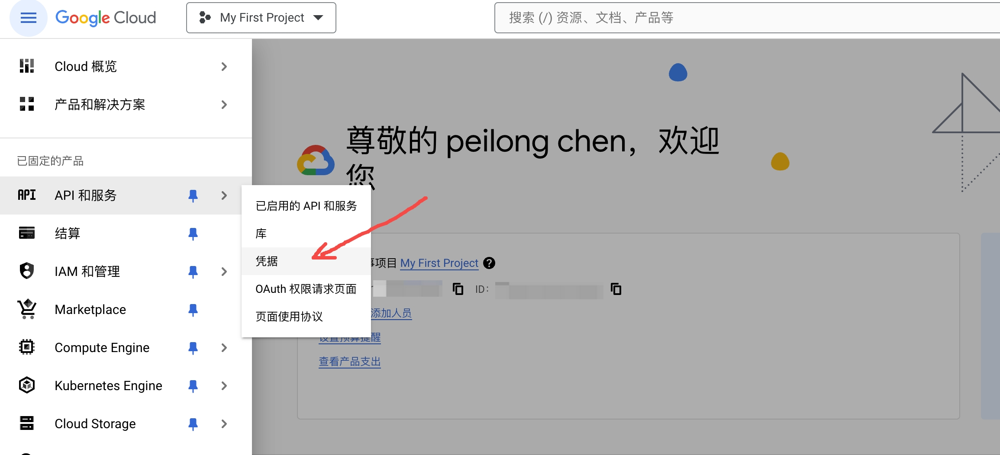
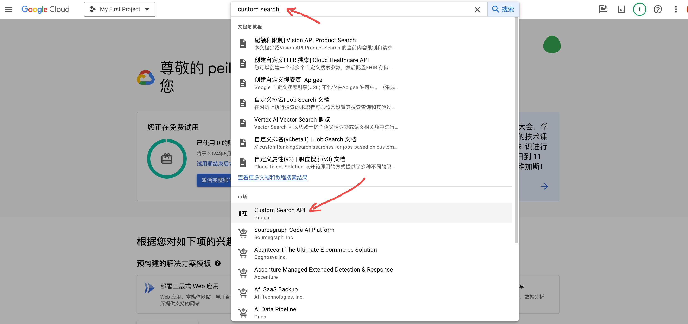
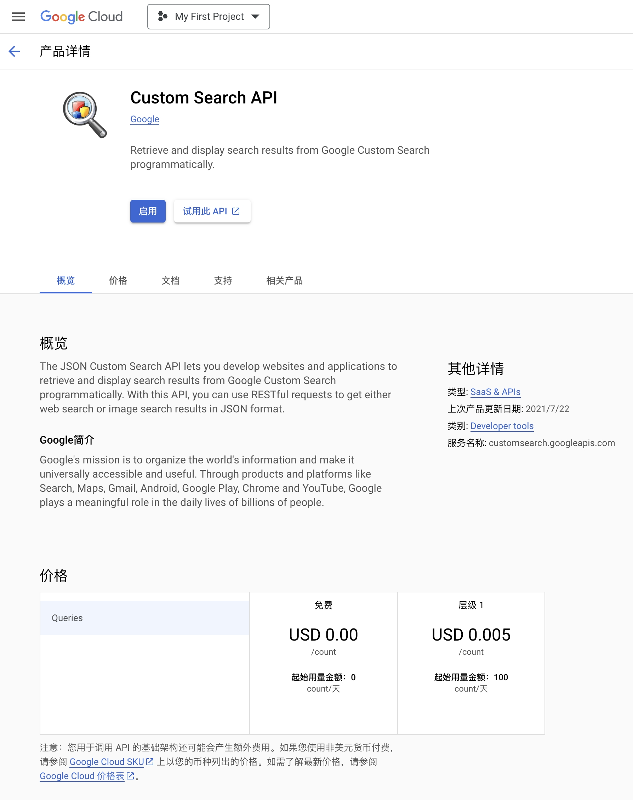

# Google Search API Use

要在你的代码中接入Google搜索，你可以通过使用Google的Custom Search JSON API来实现。这个API允许你在你的应用程序、网站或其他服务中嵌入Google搜索。以下是一些基本步骤和考虑事项：<br>
- [Google Search API Use](#google-search-api-use)
  - [获取API密钥：](#获取api密钥)
  - [启用Custom Search API：](#启用custom-search-api)
  - [创建一个自定义搜索引擎：](#创建一个自定义搜索引擎)
  - [编写代码调用API：](#编写代码调用api)


## 获取API密钥：

- 访问[Google Cloud Platform](https://cloud.google.com/)，创建一个新项目。

- 在创建的项目中，进入"API与服务"->"凭据"->"创建凭据"->"API密钥"，创建一个API密钥。这个API密钥将用于你的请求授权。




## 启用Custom Search API：

主页搜索框输入 "Custom Search API" 查找并启用它。这允许你使用此API进行搜索请求。<br>






🚨🚨🚨注意: Custom Search JSON API 每天免费提供 100 次搜索查询。 如果您需要更多实例，可以在 API 控制台中注册billing服务。额外请求的费用为每 1000 次查询 $5，每天最多 1 万次查询。<br>

## 创建一个自定义搜索引擎：

- 访问[Google Custom Search Engine](https://cse.google.com/cse/)，创建一个自定义搜索引擎（CSE）。你可以指定搜索的特定网站或全网搜索。

- 创建完成后，获取你的搜索引擎ID（cx 参数）。

如果想嵌入自己的网址，可使用以下语法，注意将 cx 参数替换为你自己的内容:<br>

```js
<script async src="https://cse.google.com/cse.js?cx=56b34ebea...">
</script>
<div class="gcse-search"></div>
```

## 编写代码调用API：

使用获取的API密钥和搜索引擎ID，你就可以在你的代码中发起搜索请求了。以下是一个使用Python的示例：<br>

```python
import os
import requests
from dotenv import load_dotenv

# 加载环境变量
dotenv_path = '.env.local'
load_dotenv(dotenv_path=dotenv_path)

# 设置网络代理环境变量
os.environ['http_proxy'] = os.getenv("HTTP_PROXY")
os.environ['https_proxy'] = os.getenv("HTTPS_PROXY")

def google_search(query):
    GOOGLE_SEARCH_API_KEY=os.getenv("GOOGLE_SEARCH_API_KEY")
    GOOGLE_SEARCH_CX=os.getenv("GOOGLE_SEARCH_CX")
    url = f'https://www.googleapis.com/customsearch/v1?key={GOOGLE_SEARCH_API_KEY}&cx={GOOGLE_SEARCH_CX}&q={query}'

    response = requests.get(url)
    result = response.json()

    return result

# 使用示例
results = google_search('OpenAI')
for item in results['items']:
    print(item['title'], item['link'])
```

这个例子使用了`requests`库来发送HTTP请求。你需要确保你的环境中安装了 `request` 和 `dotenv` 库，安装方式如下:<br>

```bash
pip install requests
pip install python-dotenv
```

通过遵循这些步骤，你可以在你的代码中成功接入Google搜索。请确保在使用这些服务时遵守Google的使用条款和政策。<br>

创建一个 `.env.local` 文件，然后写入类似以下内容:<br>

```conf
# 网络代理
HTTP_PROXY="http://127.0.0.1:7890"
HTTPS_PROXY="http://127.0.0.1:7890"
# google搜索的API-KEY
GOOGLE_SEARCH_API_KEY="AIzaSyAvtJO4..."
# google搜索的CX参数
GOOGLE_SEARCH_CX="56b34ebea58..."
```

运行上述代码，假设你的文件名为 `google_search_api.py`:<br>

```bash
python google_search_api.py
```

终端输出如下:<br>

```txt
OpenAI https://openai.com/
ChatGPT https://chat.openai.com/
Introducing ChatGPT https://openai.com/blog/chatgpt
OpenAI API: Overview https://platform.openai.com/
About https://openai.com/about
OpenAI Platform https://platform.openai.com/playground
ChatGPT — Release Notes | OpenAI Help Center https://help.openai.com/en/articles/6825453-chatgpt-release-notes
API Reference - OpenAI API https://platform.openai.com/docs/api-reference
OpenAI (@OpenAI) / X https://twitter.com/openai?lang=en
OpenAI Status https://status.openai.com/
```